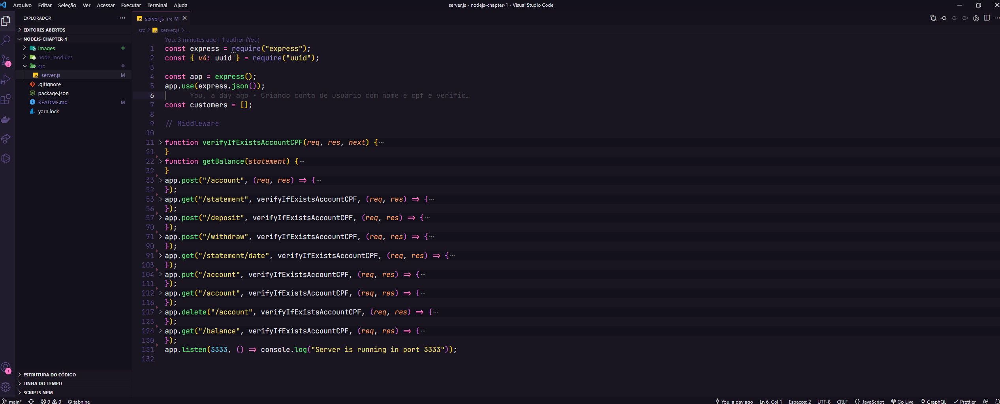
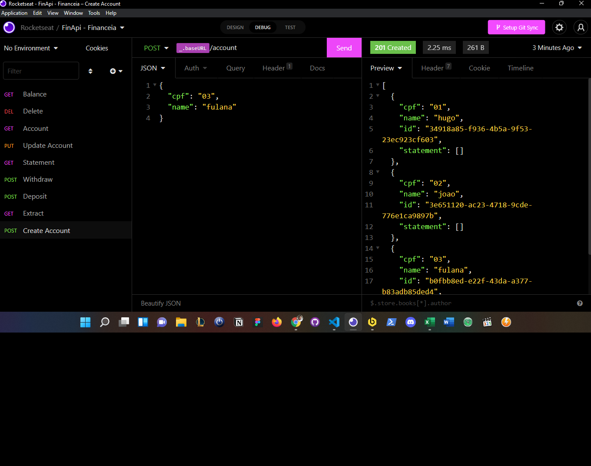

<h1 align="center">FinApi - Financeia</h1>

 

  <a href="#-tecnologias">Tecnologias</a>&nbsp;&nbsp;&nbsp;|&nbsp;&nbsp;&nbsp;
  <a href="#-projeto">Projeto</a>&nbsp;&nbsp;&nbsp;|&nbsp;&nbsp;&nbsp;
  <a href="#-como-executar">Como executar</a>&nbsp;&nbsp;&nbsp;|&nbsp;&nbsp;&nbsp;
  <a href="#-como-executar">Requisitos</a>&nbsp;&nbsp;&nbsp;|&nbsp;&nbsp;&nbsp;
  <a href="#-como-executar">Regras de negócio</a>&nbsp;&nbsp;&nbsp;|&nbsp;&nbsp;&nbsp;
  <a href="#-Rotas-criadas">Rotas criadas</a>&nbsp;&nbsp;&nbsp;|&nbsp;&nbsp;&nbsp;
  <a href="#-licença">Licença</a>

#-licença

 
 

  

## ✨ Tecnologias

Esse projeto foi desenvolvido com as seguintes tecnologias:

- [Javascript](https://developer.mozilla.org/pt-BR/docs/Web/JavaScript)
- [Node.js](https://nodejs.org/en/docs/)
- [Insomnia](https://docs.insomnia.rest/)

 
 

## 💻 Projeto

O FinApi é uma aplicação que cálcula entradas e saidas de valores, onde é possível cadastrar, consultar e excluir valores, 💰.

## 🚀 Como executar

- Clone o repositório
- Instale as dependências com `yarn`
- Inicie o servidor com `yarn dev`

A aplicação pode ser acessada em [`localhost:3333`](http://localhost:3333).

## Requisitos

    [x] Deve ser possível criar umma conta
    [x] Deve ser possível buscar o extrato bancário do cliente
    [x] Deve ser possível realizar um depósito
    [x] Deve ser possível realizar um saque
    [x] Deve ser possível buscar o extrato bancário do cliente por data
    [x] Deve ser possível atualizar dados da conta do cliente
    [x] Deve ser possível obter dados da conta do cliente
    [x] Deve ser possível deletar uma conta
    [x] Deve ser possível retornar o balance

## Regras de negócio

    [x] Não deve ser possível cadastrar uma conta com CPF já existente
    [x] Não deve ser possível fazer depósito em uma conta não existente
    [x] Não deve ser possível buscar extrato em uma conta não existente
    [x] Não deve ser possível fazer saque em uma conta não existente
    [x] Não deve ser possível fazer saque quando o saldo for insuficiente
    [x] Não deve ser possível excluir uma conta não existente

## 💻 Rotas

  

## 📄 Licença

Esse projeto está sob a licença MIT. Veja o arquivo [LICENSE](LICENSE.md) para mais detalhes.
